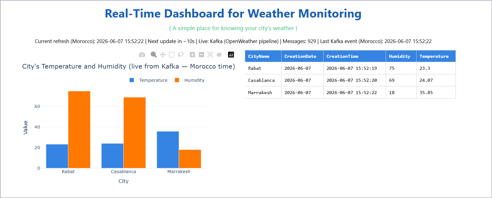

# Real-Time Weather Dashboard

End-to-end pipeline for live weather monitoring in Morocco (Rabat, Casablanca, Marrakesh), inspired by a Kafka + Spark + Hive + dashboard architecture.

---

## Project flow

Data moves through two paths: a **live path** for the dashboard and a **batch path** for storage and SQL.

```
OpenWeatherMap API
        │
        ▼
  kafka_producer.py          (Python – fetches weather every few seconds)
        │
        ▼
      Kafka                  (topic: sample_topic, port 9094 on host)
        │
        ├──────────────────────────────┐
        │                              │
        ▼                              ▼
  realtime_kafka.py              Spark Streaming
  (Dash consumer)                (WeatherStreaming.scala)
        │                              │
        ▼                              ▼
  dash_app.py                    output/weather_detail/
  (chart + table)                      │
        │                              ▼
        │                        Hive table
        │                     (weather_detail_ext)
        │                              │
        └──────── fallback ────────────┘
              (if Kafka has no data yet)
```

### Step by step

1. **Ingestion** – `kafka_producer.py` calls the OpenWeather API for Rabat, Casablanca, and Marrakech and publishes JSON messages to Kafka (`CityName`, `Temperature`, `Humidity`, `CreationTime` in Morocco time).

2. **Messaging** – Kafka (Docker) buffers the stream on topic `sample_topic`.

3. **Live dashboard** – `dash_app.py` reads new messages from Kafka via `realtime_kafka.py`, shows **3 rows** (one per city) and a bar chart, refreshed every **10 seconds** at http://127.0.0.1:8050.

4. **Stream processing** – Spark Structured Streaming (`spark-app`) consumes the same Kafka topic, transforms the JSON, writes CSV files to `output/weather_detail/`, and logs batches to the console.

5. **Warehouse (optional)** – Hive reads the CSV folder through an external table `weather_db.weather_detail_ext` for SQL queries in Beeline.

---

## Main components

| File / folder | Role |
|---------------|------|
| `kafka_producer.py` | OpenWeather → Kafka |
| `realtime_kafka.py` | Background Kafka consumer for Dash |
| `dash_app.py` | Real-time web dashboard (Dash + Plotly) |
| `hive_data.py` | Hive / CSV fallback when Kafka is empty |
| `time_utils.py` | Morocco timezone (`Africa/Casablanca`) |
| `spark-app/` | Scala Spark Structured Streaming job |
| `docker-compose.yml` | Kafka, Spark, Hive services |

---

## Prerequisites

- Docker Desktop
- Java 11 + SBT (to build the Spark JAR)
- Python 3.9+
- OpenWeather API key

---

## How to run

### 1. Setup (once)

```powershell
cd D:\etude\RealTime_weather_dashboard
python -m venv .venv
.\.venv\Scripts\activate
pip install -r requirements.txt
```

```powershell
cd D:\etude\RealTime_weather_dashboard\spark-app
sbt clean assembly
```

### 2. Terminal 1 – Start Docker services

```powershell
cd D:\etude\RealTime_weather_dashboard
docker-compose down --remove-orphans
docker-compose up -d kafka spark hive-metastore hive
docker logs -f spark
```

Wait until Spark prints schemas and starts streaming (no fatal errors).

### 3. Terminal 2 – Start the Kafka producer

```powershell
cd D:\etude\RealTime_weather_dashboard
.\.venv\Scripts\activate
$env:OPENWEATHER_API_KEY = "your_openweather_api_key"
python kafka_producer.py
```

### 4. Terminal 3 – Start the dashboard

```powershell
cd D:\etude\RealTime_weather_dashboard
.\.venv\Scripts\activate
python dash_app.py
```

Open in your browser: **http://127.0.0.1:8050**

Optional:

```powershell
$env:DASH_REFRESH_MS = "10000"   # refresh interval in ms (default 10s)
$env:DASH_PORT = "8191"          # custom port
```

### 5. Hive table (optional – SQL on stored data)

```powershell
docker exec -it hive-server beeline -u jdbc:hive2://localhost:10000
```

```sql
CREATE DATABASE IF NOT EXISTS weather_db;
USE weather_db;

DROP TABLE IF EXISTS weather_detail_ext;

CREATE EXTERNAL TABLE weather_detail_ext (
  CityName STRING,
  Temperature DOUBLE,
  Humidity INT,
  CreationTime STRING,
  CreationDate STRING
)
ROW FORMAT DELIMITED
FIELDS TERMINATED BY ','
STORED AS TEXTFILE
LOCATION '/output/weather_detail';

SELECT COUNT(*) FROM weather_detail_ext;
SELECT * FROM weather_detail_ext LIMIT 20;
```

### 6. Stop everything

```powershell
cd D:\etude\RealTime_weather_dashboard
docker-compose down
```

---

## Quick reference

| What | Address / command |
|------|-------------------|
| Dashboard | http://127.0.0.1:8050 |
| Kafka (host) | `localhost:9094` |
| Hive Beeline | `jdbc:hive2://localhost:10000` |
| All commands | See also `commands.txt` |

## A screen to see how the app looks

